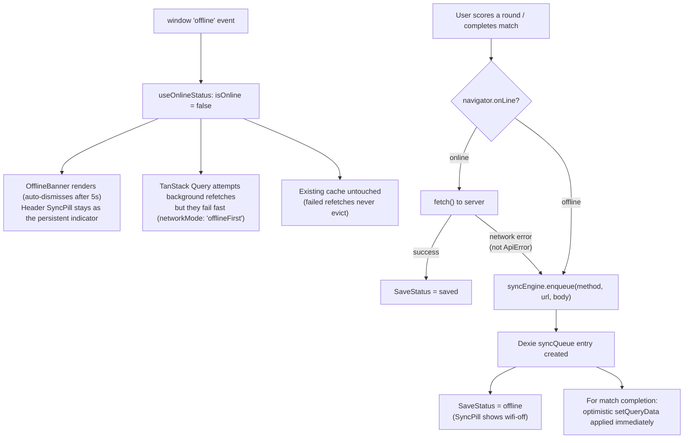
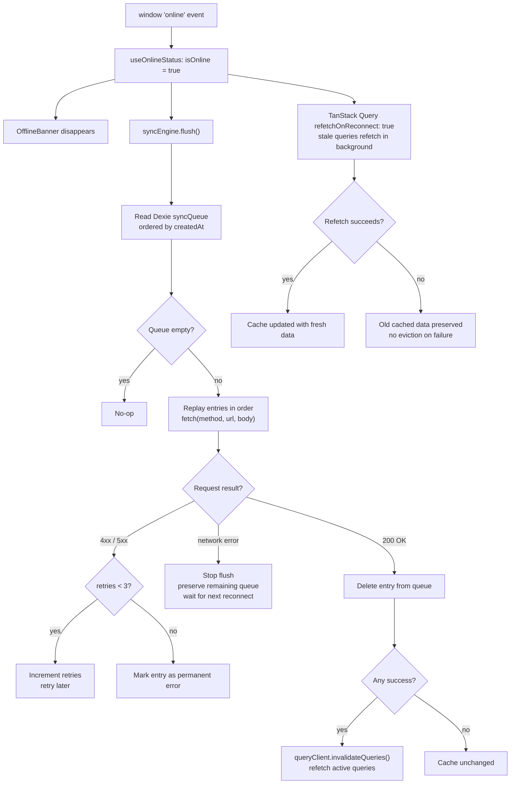

# Offline Architecture

How the app stays usable without a network connection and how it recovers when connectivity returns.

---

## The three layers

The offline system is built from three independent layers stacked on top of each other. Each layer has a distinct responsibility.

```
┌─────────────────────────────────────────────────────────┐
│  Layer 1 — App Shell (Service Worker / Workbox)         │
│  Precaches HTML + JS + CSS + fonts + icons at install.  │
│  The app can always LOAD, even with zero network.        │
└─────────────────────────────────────────────────────────┘
┌─────────────────────────────────────────────────────────┐
│  Layer 2 — Read Cache (TanStack Query → localStorage)   │
│  Persists every API response for 90 days.               │
│  Previously-fetched screens are READABLE offline.       │
└─────────────────────────────────────────────────────────┘
┌─────────────────────────────────────────────────────────┐
│  Layer 3 — Write Queue (Dexie / IndexedDB)              │
│  Mutations made offline are enqueued and replayed on    │
│  reconnect. WRITES work offline, synced on reconnect.   │
└─────────────────────────────────────────────────────────┘
```

Session caching sits alongside these layers — the user's auth session is written to `localStorage` on every successful login and used as a fallback when the session API is unreachable.

---

## Storage locations

| What | Storage | Key / DB | Duration |
|---|---|---|---|
| App shell (HTML/JS/CSS/fonts) | Service Worker Cache | Managed by Workbox | Until next deploy |
| All API responses | `localStorage` | `onboard_query_cache` | 90 days |
| Auth session | `localStorage` | `onboard_session_cache` | Until sign-out |
| Offline mutation queue | IndexedDB (Dexie `syncQueue`) | — | Until flushed |
| Player name suggestions | IndexedDB (Dexie `localProfiles`) | — | Permanent |

---

## What works offline

| Feature | Offline? | Why |
|---|---|---|
| App shell loads | ✅ Always | Workbox precache |
| Stay authenticated | ✅ If previously logged in | `useAuthSession` localStorage fallback |
| View game list | ✅ After first online session | TanStack Query persistence |
| View any game's detail page | ✅ After first online session | `usePrefetchGames` prefetches all games on login |
| View match history | ✅ If visited at least once | TanStack Query persistence |
| View a match page | ✅ If visited at least once | TanStack Query persistence |
| Score a round | ✅ Queued + shown as "offline" | `syncEngine.enqueue`, replayed on reconnect |
| Complete a match | ✅ Queued + optimistic | Queue + immediate `setQueryData` |
| Player name autocomplete | ✅ From Dexie `localProfiles` | Populated from server on each online fetch |
| Create a brand-new match | ❌ Not yet implemented | Needs `matchDrafts` flow (planned Phase 6) |
| First-ever app open offline | ❌ Impossible in practice | Google OAuth requires network; prefetch runs on login |

---

## Key files

| File | Responsibility |
|---|---|
| `src/client/hooks/useAuthSession.ts` | Offline-safe session wrapper |
| `src/client/hooks/useOnlineStatus.ts` | Detects online/offline, triggers sync on reconnect |
| `src/client/hooks/usePrefetchGames.ts` | Warms the game-detail cache on every authenticated session |
| `src/client/hooks/usePlayerSuggestions.ts` | Syncs player suggestions to Dexie |
| `src/client/lib/db.ts` | Dexie schema (`localProfiles`, `syncQueue`, `matchDrafts`) |
| `src/client/lib/sync.ts` | `syncEngine.enqueue()` and `syncEngine.flush()` |
| `src/client/lib/query-client.ts` | TanStack Query with 90-day `gcTime` |
| `src/client/main.tsx` | `PersistQueryClientProvider` wiring |
| `src/client/components/layout/OfflineBanner.tsx` | UI indicator for offline state |

---

## Online → Offline

When the `offline` window event fires (or `navigator.onLine` becomes false):



---

## Offline → Online

When the `online` window event fires:



---

## staleTime vs gcTime — what each one does

These two settings are independent and easy to confuse:

| Setting | Value | Controls |
|---|---|---|
| `staleTime` (global) | 60 s | When online: after 60 s, a query is considered stale and will refetch in the background on next mount/focus |
| `staleTime` (prefetchQuery) | 1 h | Optimization: don't re-prefetch game details if already fetched within the last hour |
| `gcTime` | 90 days | When a query has no active subscribers, how long before its data is removed from cache |
| `maxAge` (persistQueryClient) | 90 days | How long the entire localStorage snapshot is valid; if older, it is discarded on startup |
| `networkMode` | `offlineFirst` | Cached queries always serve their data first; refetches happen but failed offline refetches never evict the cache and never leave the query stuck in a permanent pending state |
| persister `throttleTime` | `0` | Persist writes happen immediately so prefetched data survives a refresh that comes seconds after login |

**Rule of thumb:** `staleTime` governs online freshness. `gcTime` / `maxAge` govern offline resilience. They are completely independent.

---

## Cache invalidation rules

The cache is **never** evicted due to a failed network request. The only ways it changes are:

1. **Background refetch succeeds** → fresh data replaces old data (normal online operation)
2. **`syncEngine.flush()` has at least one success** → `queryClient.invalidateQueries()` is called, triggering refetches of active queries (only after confirmed server writes)
3. **`gcTime` expires for an inactive query** → entry removed from cache (90 days of inactivity)
4. **`maxAge` exceeded on startup** → entire localStorage snapshot discarded (90 days since last session)
5. **Explicit sign-out** → session cache cleared; query cache is NOT cleared (data remains for the next login)

**Key invariant:** a brief online blip (1-second connection, failed refetch) cannot empty the cache.
