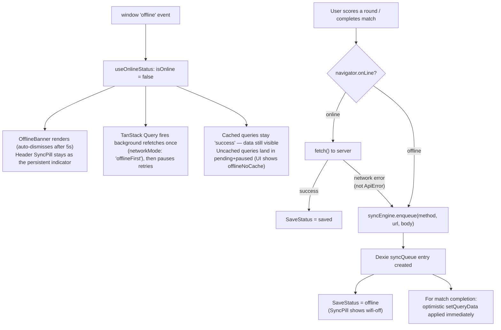
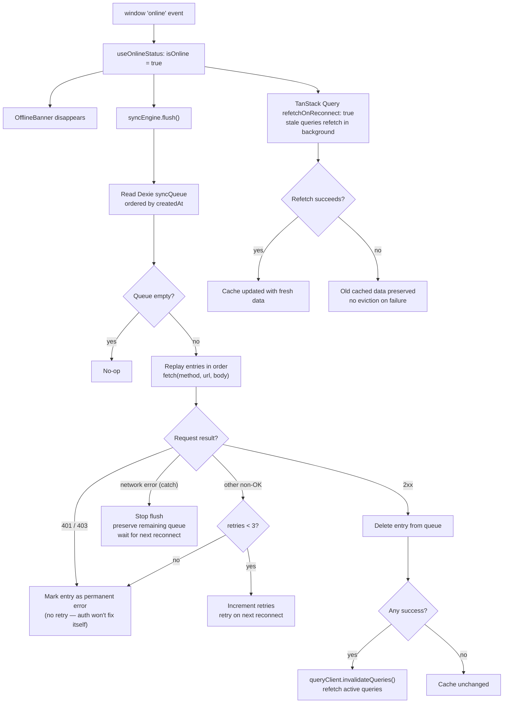

# Offline Architecture

How the app stays usable without a network connection and how it recovers when connectivity returns.

---

## The three layers

The offline system is built from three independent layers stacked on top of each other. Each layer has a distinct responsibility.

```
┌─────────────────────────────────────────────────────────┐
│  Layer 1 — App Shell (Service Worker / Workbox)         │
│  Precaches HTML + JS + CSS + fonts + icons at install.  │
│  The app can always LOAD, even with zero network.        │
└─────────────────────────────────────────────────────────┘
┌─────────────────────────────────────────────────────────┐
│  Layer 2 — Read Cache (TanStack Query → localStorage)   │
│  Persists every API response for 90 days.               │
│  Previously-fetched screens are READABLE offline.       │
└─────────────────────────────────────────────────────────┘
┌─────────────────────────────────────────────────────────┐
│  Layer 3 — Write Queue (Dexie / IndexedDB)              │
│  Mutations made offline are enqueued and replayed on    │
│  reconnect. WRITES work offline, synced on reconnect.   │
└─────────────────────────────────────────────────────────┘
```

Session caching sits alongside these layers — the user's auth session is written to `localStorage` on every successful login and used as a fallback when the session API is unreachable.

### Layer 2 hydration timing

Cache restoration runs **synchronously at module load** in `main.tsx`, before `createRoot().render()`. We deliberately don't use `PersistQueryClientProvider`: it restores via a `useEffect`, one async tick after the first render, which leaves a window where queries fire against an empty cache and — offline — get stuck `pending+paused`. The synchronous path means every `useQuery` subscriber finds its data on the very first render. Ongoing writes are handled by `persistQueryClientSubscribe`, which writes the dehydrated cache to `localStorage` on every cache event.

### `gcTime: Infinity` (don't change without reading this)

The QueryClient uses `gcTime: Infinity`. This is **not optional** for offline-first behavior. `setTimeout` is capped at ~24.8 days (`2^31-1` ms); any larger value overflows and fires immediately in most browsers, which causes any query without a permanent observer — in particular every entry created via `prefetchQuery` — to be garbage-collected microseconds after it succeeds. That breaks `usePrefetchGames` entirely: detail/matches queries are evicted before the user clicks into them.

`Infinity` is TanStack Query v5's explicit "never GC" sentinel. Disk-side retention is bounded by a manual `NINETY_DAYS` timestamp check in `main.tsx` on startup (`Date.now() - stored.timestamp > NINETY_DAYS`), unaffected by the `setTimeout` cap.

---

## Storage locations

| What | Storage | Key / DB | Duration |
|---|---|---|---|
| App shell (HTML/JS/CSS/fonts) | Service Worker Cache | Managed by Workbox | Until next deploy |
| All API responses | `localStorage` | `onboard_query_cache` | 90 days |
| Auth session | `localStorage` | `onboard_session_cache` | Until sign-out |
| Offline mutation queue | IndexedDB (Dexie `syncQueue`) | — | Until flushed |
| Player name suggestions | IndexedDB (Dexie `localProfiles`) | — | Permanent |

### Why two storage systems?

The split between `localStorage` (TanStack persister) and IndexedDB (Dexie) is not arbitrary — each has a property the other can't match.

**`localStorage` — synchronous, single-blob, ~5 MB cap.** The query persister lives here because it's the *only* synchronous storage API in the browser. We read the dehydrated snapshot at module load in `main.tsx` *before* `createRoot().render()`, so the first render of every `useQuery` already has data. If we used IndexedDB instead, hydration would slip into a `useEffect` and we'd be back to the empty-cache flash that gets stuck `pending+paused` offline (see *Layer 2 hydration timing* above). The auth session lives here for the same reason — `useAuthSession` needs it on first render.

**IndexedDB / Dexie — async, structured tables with indexes, transactions, large capacity.** Used for everything client-authoritative: the mutation queue (`syncQueue`) needs ordered iteration, per-record updates, and atomicity (a partially-written queue entry would be a bug); player suggestions (`localProfiles`) and future match drafts (`matchDrafts`) can grow beyond what fits in a single localStorage blob. None of these consumers are on the first-paint path — the queue is processed on reconnect, suggestions feed a typeahead — so async access is fine.

**Selection criteria** when adding new persisted state:

| Question | If yes → |
|---|---|
| Must be readable **synchronously** before first render? | localStorage |
| Is it a **read snapshot of server state** the query layer owns? | localStorage (let TanStack persister handle it) |
| Does it need **indexes, ordering, or atomic per-record writes**? | IndexedDB (Dexie) |
| Is it **client-authoritative** (pending mutations, local-only data)? | IndexedDB (Dexie) |
| Could it grow beyond a few MB over time? | IndexedDB (Dexie) |

Rule of thumb: **server-sourced + needed on cold boot → query persister. Client-owned, queue-shaped, or growing → Dexie.**

---

## What works offline

| Feature | Offline? | Why |
|---|---|---|
| App shell loads | ✅ Always | Workbox precache |
| Re-open after previous login | ✅ If previously logged in | `useAuthSession` localStorage fallback; the login route auto-redirects to `/games` even when the session is the offline-fallback copy |
| View game list | ✅ After first online session | TanStack Query persistence |
| View any game's detail page | ✅ After first online session | `usePrefetchGames` prefetches each game's detail and matches list on every authenticated session |
| View match history | ✅ After first online session | `usePrefetchGames` prefetches per-game `["matches", { gameId }]` on every authenticated session |
| View a match page | ✅ Cold-start ready for any match in history | The list response already carries `players` + `scores`; `usePrefetchGames` hydrates `["matches", id]` from each list entry via `setQueryData`, so a tap on any past match is an instant cache hit even if the user has never opened it before |
| Score a round | ✅ Queued + shown as "offline" | `syncEngine.enqueue`, replayed on reconnect; cache also patched optimistically so navigation away preserves the values |
| Complete a match | ✅ Queued + optimistic | Queue + immediate `setQueryData` |
| Player name autocomplete | ✅ Always | Three-tier resolution: server response (authoritative), synthesized self entry from the auth session (fallback), Dexie `localProfiles` (offline). Self is always the first chip even on a brand-new install with no match history |
| Create a brand-new match | ✅ Via `matchDrafts` | Synthetic match seeded into the cache + queued POST; reconciliation on reconnect rewrites draft ids to real ids |
| First-ever app open offline | ❌ Impossible in practice | Google OAuth requires network; prefetch runs on first authenticated session |

---

## Key files

| File | Responsibility |
|---|---|
| `src/client/hooks/useAuthSession.ts` | Offline-safe session wrapper |
| `src/client/hooks/useOnlineStatus.ts` | Detects online/offline, triggers sync on reconnect |
| `src/client/hooks/usePrefetchGames.ts` | Warms the game-detail cache on every authenticated session |
| `src/client/hooks/usePlayerSuggestions.ts` | Syncs player suggestions to Dexie |
| `src/client/lib/db.ts` | Dexie schema (`localProfiles`, `syncQueue`, `matchDrafts`) |
| `src/client/lib/sync.ts` | `syncEngine.enqueue()` and `syncEngine.flush()` |
| `src/client/lib/query-client.ts` | TanStack Query with `gcTime: Infinity` (see hydration-timing section) |
| `src/client/main.tsx` | Synchronous hydrate + `persistQueryClientSubscribe` for ongoing writes |
| `src/client/components/layout/OfflineBanner.tsx` | UI indicator for offline state |
| `src/client/components/layout/UpdateBanner.tsx` | Surfaces "New version available" when a new SW finishes installing |

---

## Login when offline

A previously-authenticated user who opens the app offline lands in `/games`, not on the login screen. The chain:

1. `useAuthSession` returns the cached session (`isOfflineFallback: true`) when `navigator.onLine` is false and a session exists in `localStorage`.
2. The login route (`/`) redirects on **any** non-pending session — including the offline-fallback copy. The `_authenticated` layout owns the offline UX (OfflineBanner, SyncPill, `offlineNoCache` per page).
3. If no session is cached, the login route stays put. Sign-in requires Google OAuth, which needs network — there's nothing useful to do offline without a session.

Earlier the redirect explicitly skipped offline-fallback sessions to avoid "silently entering with stale credentials." That guard is gone: a cached session can't do anything dangerous offline (no writes hit the server), and stranding the user on a useless login screen prevents them from reaching their own cached data.

---

## Player suggestions — three-tier resolution

`usePlayerSuggestions` resolves suggestions from three sources, in priority order, and merges them case-insensitively:

1. **Server response** — `GET /api/players/suggestions` (cached + persisted via TanStack Query). Authoritative when available: its `isSelf` row already reflects the current alias.
2. **Synthesized self entry** — `{ name: session.user.alias || session.user.name, isSelf: true }`, computed from the auth session. Used **only** when no server response has landed (offline-first install / first paint).
3. **Dexie `localProfiles`** — fallback when the server query is paused/errored. Populated by every successful server fetch (non-self rows only) and by `persistPlayersToLocalProfiles` after a match is created.

The self entry is **not** persisted to Dexie. Two reasons: the auth session is itself cached (`onboard_session_cache` in localStorage + better-auth's reactive cache), so the synthesized self survives reloads without a Dexie copy; and persisting `{ name: previousAlias, isSelf: true }` would resurrect the old alias as a phantom suggestion after the user changes it. The server's `isSelf` row is filtered out of the Dexie mirror for the same reason.

The session payload from `authClient.useSession()` can lag behind a recent `updateUser` call by a tick or two — that's why the server response wins over the synth when both are available, instead of the synth being unconditionally pushed first. The new-match form uses the existing `suggestions.find(s => s.isSelf)?.name` path to attribute the user's `userId` on submit.

---

## Match drafts (offline match creation)

Creating a brand-new match works without a network. The flow:

1. **Submit while offline** — `$slug_.new.tsx` detects `!navigator.onLine` (or catches a network error from the POST attempt) and synthesizes a `Match` shape with id `draft_<uuid>` and per-player ids `draftp_<uuid>`. The match is seeded into the TanStack cache (`["matches", draftId]`) and into the cached match-list (`["matches", { gameId }]`) so it shows up in history immediately.
2. **Persist intent** — a `matchDrafts` row records the gameId, players, and a queue entry is pushed to `syncQueue`: `POST /api/matches { draftId, players: [{ ..., draftPlayerId, position }] }`.
3. **Score the draft** — `SkullKingScorer` and `SevenWondersDuelScorer` detect `match.id.startsWith("draft_")` inside their `mutationFn` and short-circuit to `applyOptimistically(...)` + `syncEngine.enqueue(...)` instead of calling the server. The mutation resolves successfully (no rejection), so flows that `await mutateAsync` (e.g. SK's end-of-round flush) keep working. The match page shows a "Draft" badge in the header.
4. **Reconciliation on reconnect** — `syncEngine.flush()` walks the queue in order. When a `POST /api/matches` succeeds, the response (real `match.id` + per-position `players[].id`) is used to build a `matchIdMap` (draft id → real id) and `playerIdMap` (draft player id → real player id). Subsequent queue entries get their URL and JSON body string-substituted via these maps before the fetch fires.
5. **URL fixup** — once a draft is mapped to a real id, the match route detects the `matchDrafts.realId` field (or receives a `SYNC_DRAFTS_RESOLVED_EVENT` for live sessions) and `navigate(..., { replace: true })`s to `/matches/<realId>`, deleting the draft row.

The string-level substitution is safe because draft ids are formatted with a `draft_` / `draftp_` prefix + a UUID — they cannot collide with anything else on the wire.

---

## Service-worker update flow

`vite-plugin-pwa` is configured with `registerType: "prompt"`. The new SW finishes its `install` event (precache populated) before the user can act, and only then does the `UpdateBanner` (mounted from `__root.tsx`) render "New version available — Reload". This eliminates the stale-precache window observed during PR #8 testing, where fonts loaded from the new CSS bundle while the old SW still controlled the page.

`useRegisterSW` from `virtual:pwa-register/react` is called inside `UpdateBanner` and is the only registration site — `main.tsx` no longer calls `registerSW({ immediate: true })`.

---

## Where offline runs

The offline machinery is **not exclusive to installed PWAs**. IndexedDB (Dexie) and Service Worker precache work in every modern browser — desktop Chrome/Firefox/Safari/Edge, mobile Chrome/Safari, whether the user has installed the PWA or just visited the site. After one online visit, the next visit works offline regardless of how the app is launched.

What "installed PWA" adds:

- **Standalone window** (no browser chrome) and a home-screen icon
- **Background Sync API** on Chromium-based browsers — lets the queue replay even if the app/tab is closed (iOS Safari does not support this yet)
- iOS Safari supports installable PWAs since 16.4 but limits Background Sync and push notifications

Practical implication: nothing in this architecture is mobile-only or PWA-only. The same offline UX runs on a desktop Chrome tab.

---

## Online → Offline

When the `offline` window event fires (or `navigator.onLine` becomes false):



---

## Offline → Online

When the `online` window event fires:



---

## staleTime vs gcTime — what each one does

These two settings are independent and easy to confuse:

| Setting | Value | Controls |
|---|---|---|
| `staleTime` (global) | 60 s | When online: after 60 s, a query is considered stale and will refetch in the background on next mount/focus |
| `staleTime` (prefetchQuery) | 1 h | Optimization: don't re-prefetch game details if already fetched within the last hour |
| `gcTime` | `Infinity` | In-memory eviction is fully disabled — see the "`gcTime: Infinity`" section above for why this is mandatory, not a tuning choice |
| `NINETY_DAYS` (manual check in `main.tsx`) | 90 days | How long the entire localStorage snapshot is valid; if older, it is discarded on startup |
| `networkMode` | `offlineFirst` | The queryFn always fires once (even offline); retries are then paused (`isPaused: true`) until connectivity returns. Queries with cached data stay `'success'` and render normally. Queries with no cached data land in `pending+paused`; the UI detects this via `isPaused` and shows the offline-no-cache message instead of an infinite spinner. |

> Online detection uses the browser's native `navigator.onLine` and the `online`/`offline` window events. This works reliably under both real network changes (WiFi off/on, airplane mode) and Chrome DevTools' "Offline" Network throttle (which is also what Playwright's `BrowserContext.setOffline(true)` uses under the hood, so the E2E suite exercises the same code path).

**Rule of thumb:** `staleTime` governs online freshness. The startup `NINETY_DAYS` check governs offline resilience. They are completely independent (and `gcTime` is out of the picture entirely — see above).

---

## Cache invalidation rules

The cache is **never** evicted due to a failed network request. The only ways it changes are:

1. **Background refetch succeeds** → fresh data replaces old data (normal online operation)
2. **`syncEngine.flush()` has at least one success** → `queryClient.invalidateQueries()` is called, triggering refetches of active queries (only after confirmed server writes)
3. **`NINETY_DAYS` check fails on startup** → entire localStorage snapshot discarded (90 days since last session)
4. **Explicit sign-out** → session cache cleared; query cache is NOT cleared (data remains for the next login)

**Key invariant:** a brief online blip (1-second connection, failed refetch) cannot empty the cache.

---

## Offline UX

- `OfflineBanner` (`src/client/components/layout/OfflineBanner.tsx`) renders an amber strip across the top of every authenticated page when `useOnlineStatus()` reports offline. It auto-dismisses after 5 seconds so it doesn't permanently steal vertical space.
- After dismissal, the persistent indicator is the small `SyncPill` that the global `Header` auto-renders whenever offline (the match page keeps its own SyncPill via the existing `right` slot).
- Game-detail (`/games/$slug`) and match (`/matches/$id`) pages both distinguish a real 404 from an offline cache miss. When offline with no cached data (`isPaused: true`), they show `common.offlineNoCache` ("This page wasn't saved for offline use…") instead of an indefinite spinner.
