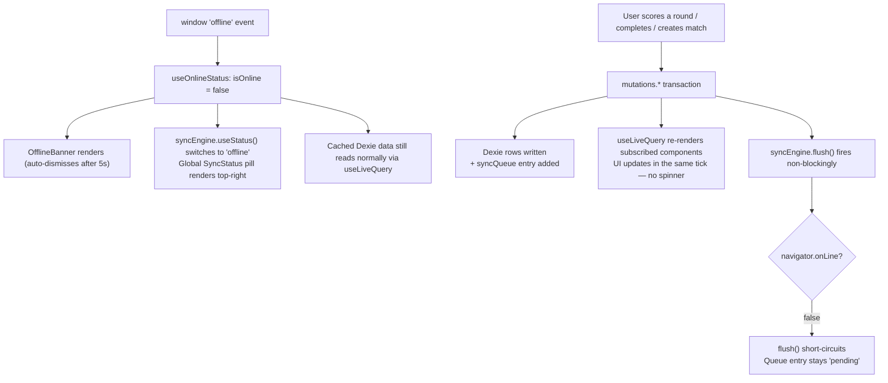
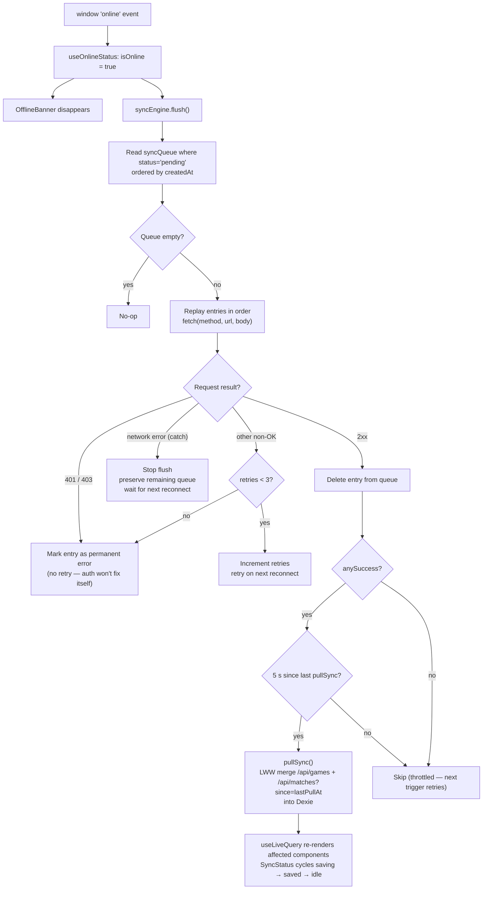

# Offline Architecture

How the app stays usable without a network connection and how it recovers when connectivity returns.

The app uses a **local-first two-layer** design: the Service Worker keeps the app shell available, and a Dexie (IndexedDB) mirror of the server holds all the user's data. Every read goes to Dexie via `useLiveQuery`; every write goes to Dexie first and queues a server replay. There is no separate read cache and no synchronous-hydration step at boot.

---

## The two layers

```
┌─────────────────────────────────────────────────────────┐
│  Layer 1 — App Shell (Service Worker / Workbox)         │
│  Precaches HTML + JS + CSS + fonts + icons at install.  │
│  The app can always LOAD, even with zero network.        │
└─────────────────────────────────────────────────────────┘
┌─────────────────────────────────────────────────────────┐
│  Layer 2 — Local mirror (Dexie / IndexedDB)             │
│  Single source of truth on the client. Holds full row   │
│  mirrors of games / matches / players / scores /        │
│  profiles, an outbound sync queue, and a pull-cursor    │
│  keystore.                                              │
└─────────────────────────────────────────────────────────┘
```

Auth-session caching sits alongside the two layers — the user's better-auth session is mirrored to `localStorage` so `useAuthSession` can resolve synchronously on first render even when the network is unreachable.

### Why a Dexie mirror instead of a query-cache

The previous design ran a persisted TanStack Query cache (`localStorage`) for reads and a Dexie write-queue for offline mutations, with a one-shot synchronous hydrate at module load to avoid an empty-cache flash. That design had three structural problems:

1. **Two sources of truth.** A successful queued mutation had to both write to the server *and* invalidate the right query keys, or the UI showed stale values until `staleTime` expired.
2. **No real offline creation.** Brand-new resources needed a draft id and a reconciliation step at flush time. A first attempt (PR #11 `matchDrafts`) generated cascading bugs and was scrapped.
3. **`gcTime: Infinity` plus a `setTimeout`-cap workaround.** The persisted cache forced the in-memory cache to be permanent (otherwise prefetched entries were GC'd before the user clicked into them), which then required a manual 90-day disk eviction check.

The Dexie-mirror design removes all three: `useLiveQuery` is reactive on Dexie writes (no invalidation), client-generated CUIDs are real ids from the moment of local write (no drafts), and there is no in-memory cache TTL to manage.

---

## Storage locations

| What | Storage | Key / table | Duration |
|---|---|---|---|
| App shell (HTML/JS/CSS/fonts) | Service Worker Cache | Managed by Workbox | Until next deploy |
| Auth session | `localStorage` | `onboard_session_cache` | Until sign-out |
| Games catalogue | IndexedDB (Dexie `games`) | — | Permanent — pulled on every authenticated session |
| Match list / detail | IndexedDB (Dexie `matches` + `players` + `scores`) | — | Permanent — incremental pull from `/api/matches?since=` |
| Outbound mutation queue | IndexedDB (Dexie `syncQueue`) | — | Until flushed (or permanently failed) |
| Pull-sync cursor | IndexedDB (Dexie `syncMeta`) | `lastPullAt` | Permanent — advanced on each successful pull |
| Profiles (Players tab + new-match autocomplete) | IndexedDB (Dexie `profiles`) | — | Permanent — pulled by `pullSync` from `/api/profiles?since=` |

The auth session stays on `localStorage` because better-auth needs it synchronously on first render. Everything else is async via Dexie.

### Dexie schema

The current schema is version 5 (declared in `src/client/lib/db.ts`):

| Table | Primary key | Indexes |
|---|---|---|
| `syncQueue` | `++id` | `createdAt`, `status` |
| `games` | `id` | `slug` |
| `matches` | `id` | `gameId`, `status`, `startedAt`, `updatedAt`, `[createdById+startedAt]` |
| `players` | `id` | `matchId`, `profileId`, `profileLinkedUserId`, `[matchId+position]` |
| `scores` | `id` | `matchId`, `[matchId+playerId+category]`, `updatedAt` |
| `profiles` | `id` | `ownerId`, `linkedUserId`, `usedAt`, `updatedAt` |
| `syncMeta` | `key` | — |

#### v1 → v2 upgrade

For users on a prior build, the upgrade callback does two things in a single transaction:

1. **Reclassify legacy `syncQueue` rows.** v1 used a free-form `error` string ("" / unset for healthy, set for permanently failed). v2 promotes that to an explicit `status: "pending" | "failed"` so the live-query indexer can answer "pending count" without a full scan.
2. **One-shot hydrate from the abandoned persisted query cache.** If `localStorage["onboard_query_cache"]` is present, parse it tolerantly (anything unrecognised is skipped, never thrown) and seed the `games` / `matches` / `players` / `scores` tables. After parsing, the localStorage key is deleted. The hydrate is best-effort: any failure falls through to `pullSync()` on the next online tick.

The `matchDrafts` table from v1 is dropped (`stores: { matchDrafts: null }`) — PR #11 abandoned that approach and nothing in shipped code ever wrote to it.

#### v2 → v3 upgrade

Introduced by PR 6-A (Profile entity + Players tab). The upgrade drops the v2 `localProfiles` table — its purpose (name-keyed autocomplete + linked-user metadata) is now served by the server-mirrored `profiles` table, which is repopulated from `/api/profiles` on the next `pullSync()`. The `profiles` table is added (alongside `profileGroups` / `profileGroupMembers`, which v5 later removes) and the `players` index gains `profileId` for the per-profile match-history queries.

#### v4 → v5 upgrade

Drops the unused `profileGroups` and `profileGroupMembers` stores. Phase 6-D (favorite player groups) was abandoned in favor of the "played-with" suggestions shipped in PR 6-B; neither store ever received any rows.

---

## Reading data

UI components read via reactive Dexie hooks under `src/client/hooks/data/`:

| Hook | Returns | Used by |
|---|---|---|
| `useGames()` | `{ data: LocalGame[] \| undefined, status }` | `/games` list |
| `useGame(slug)` | `{ data: LocalGame \| undefined, status }` | `/games/$slug`, `/games/$slug/new` |
| `useMatchList(gameId?)` | `{ data: LocalMatch[] \| undefined, status }` | `/games/$slug` match history |
| `useMatch(id)` | `{ data: Match \| undefined, status }` | `/matches/$id` (joins `matches` + `players` + `scores`) |

Each hook wraps `useLiveQuery` from `dexie-react-hooks`. The returned `status` is one of `"loading"` (initial Dexie read in flight), `"ok"` (data resolved), or `"missing"` (Dexie resolved but the row doesn't exist locally — neither offline-no-cache nor a real 404, but functionally the offline-no-cache case).

Because `useLiveQuery` subscribes to the queried tables, any local write (from `mutations.*` or from `pullSync()`) automatically re-renders every subscribed component in the same tick. There is no manual invalidation.

---

## Writing data

All mutating user actions go through `src/client/lib/mutations.ts`:

| Function | What it writes locally | What it enqueues |
|---|---|---|
| `createMatch(input)` | `matches` row + N `players` rows (client-generated CUIDs) | `POST /api/matches` |
| `upsertScores(input)` | `scores` rows (creates or updates by `[matchId+playerId+category]`) + bumps `matches.updatedAt` | `PATCH /api/matches/:id/scores` |
| `patchMatch(input)` | `matches` row (metadata) + `players` rows (reorder) | `PATCH /api/matches/:id` |
| `completeMatch(input)` | `matches` row (status, victoryType, winnerId, completedAt) | `PUT /api/matches/:id` |

Every mutation opens a single Dexie transaction that spans the affected tables plus `syncQueue`. Either every row write *and* the queue entry land together, or none do. After the transaction commits, `syncEngine.flush()` fires non-blockingly — the caller never awaits the network.

### Idempotent replay

Match ids, player ids, and score ids are client-generated CUIDs (`@paralleldrive/cuid2`). `POST /api/matches` is server-side idempotent on `id` (PR A / #15): a replay of an already-accepted POST returns the existing record with 200 rather than 409. The queue is therefore safe to flush any number of times without producing duplicate rows.

`upsertScores` is structurally idempotent on the server: re-sending the same `[playerId, category, value]` triple is a no-op.

### Missing local rows

`patchMatch`, `completeMatch`, and `touchMatchUpdatedAt` look up the match row before patching it; if the row is absent (rare — implies pullSync hasn't caught up, or Dexie was wiped mid-session) the local update is skipped, the queued network request is enqueued anyway, and `warnMissingLocalMatch` logs the inconsistency. The server is authoritative; a missed local write surfaces only as a brief stale view that the next `pullSync()` corrects.

---

## Pulling server changes

`src/client/lib/pull-sync.ts` exports `pullSync()` — the read counterpart to `flush()`. It is called:

- on app boot (`usePullOnAuth`, fired once when the auth session resolves — passes `{ force: true }`)
- after a successful `syncEngine.flush()` (post-mutation cross-device updates — throttled)
- on the browser `online` event (via `useOnlineStatus`)
- on tab regain (`usePullSyncBackground` listens to `visibilitychange` — passes `{ force: true }`)
- on in-app route change (`usePullSyncBackground` watches `useRouterState` pathname — throttled)

### Throttle

`pullSync()` is throttled to a **5-second minimum interval** between attempts. This dedupes the post-flush wave that would otherwise fire on every score input — without it, four rapid `setScore` calls produce four full `/api/games` + `/api/matches?since=` round-trips in a span of about one second.

The throttle is module-scoped (`lastPullStartedAt`), so a page reload resets it (which is fine — `usePullOnAuth` always runs a forced pull on mount). Explicit triggers — boot, `visibilitychange` — pass `{ force: true }` to bypass; throttle-respecting triggers — post-flush, route change — let the dedup apply.

`pullSync()` runs three independent per-endpoint fetch → transaction pipelines (so a hung fetch on one can't strand the others):

1. **Full pull of `/api/games`.** The catalogue is small (≤ a dozen) and rarely changes, so we just refresh it.
2. **Incremental pull of `/api/matches?since={lastPullAt}`.** The cursor lives in `syncMeta["lastPullAt"]`. First call has no `since` and pulls everything; subsequent calls only fetch matches with `updatedAt > since`.
3. **Incremental pull of `/api/profiles?since={lastProfilesPullAt}`.** Mirrors the same LWW pattern as matches — the cursor is stored separately so a profile-only edit on another device propagates without re-fetching every match.

The merge is **per-row Last-Write-Wins on `updatedAt`**: for each incoming match, if the local copy's `updatedAt >= incoming.updatedAt`, the incoming match (and its child rows) are skipped entirely. Otherwise the match, players, and scores are upserted, and any local child rows of that match that no longer exist on the server are pruned (so we don't accumulate orphans).

If `navigator.onLine` is false at the start of the call, `pullSync()` short-circuits immediately — there's no useful work to do.

### Link / unlink transitions (PR 6-C)

The bilateral profile link surfaces two server-side visibility changes that the `?since=` cursor cannot represent on its own. `mergeProfiles` watches every incoming profile row against its local copy and returns a `{ link, unlink }` flag pair:

- **Link transition** (`linkedUserId` went from `null` to a value): the friend's pre-link matches were already on the server but their `Match.updatedAt` predates our last pull cursor, so a normal `?since=` delta misses them. After the merge transaction commits, `pullSync()` calls `resetPullCursors()` (drops `lastPullAt` + `lastProfilesPullAt`) and recursively re-invokes itself with `{ force: true }` to bypass the throttle. The recursive call refetches both endpoints with no `?since=` filter, so the friend's full history lands in a single follow-up round-trip. The scanner's `linkProfile` mutation also performs an eager reset+pull on success; the pull-side detection is the shower's path, since their celebration is driven by `LinkCodeDisplay` polling rather than a direct mutation.

- **Unlink transition** (`linkedUserId` went from a value to `null`): the matches that were only visible through the link drop out of the server's visibility filter, but `?since=` deltas can't represent deletions. After the merge, `pullSync()` calls `pruneLocalMatchesAgainstServer()` — a full `/api/matches` fetch whose IDs are diffed against Dexie, with the missing rows (and their child players/scores) removed locally. This path fires whenever *we* learn about the unlink through a pull (the friend pressed Unlink on their device); the local Unlink button has its own bilateral-unlink mutation that prunes synchronously.

Both transitions are detected inside the profiles' Dexie transaction so the flag is set strictly when the merge actually flipped state.

### Alias propagation

The viewer's reactive owned-profile index (`useOwnedProfileIndex`) is the canonical source for friend-alias rendering. Every name-rendering call site (`MatchHistoryRow`, the scorer screens, `Avatar`) reads through the index, which is a `useLiveQuery` over `profiles` keyed on the viewer. A `patchProfile` Dexie write — what the Players-tab alias editor performs — immediately invalidates the live query and every consumer re-renders with the new alias. No mirror write-through is needed for friend aliases.

The viewer's own `User.alias` is a separate problem: it's denormalized onto two locations that *can't* be reached through `profiles` alone, because Settings edits don't bump `Match.updatedAt`:

1. Every `LocalPlayer.user.alias` row joined to that user (legacy display paths the scorers still read).
2. The self-`LocalProfile.alias` — mirroring the server's `resolveSelfAlias` fallback: trimmed `newAlias` when set, otherwise `linkedUser.name`, otherwise `"Me"`. The fallback matters when the user *clears* their alias via Settings, since the server-side `syncSelfProfileAlias` writes `User.name` (not an empty string) onto `Profile.alias`.

`refreshLocalAliases(userId, newAlias)` rewrites both in a single Dexie pass; Settings calls it directly after `updateProfile`.

The `player.user.alias` half is acknowledged as a tactical fix and is tracked in [issue #19](https://github.com/jolelievre/on-board/issues/19) — once the legacy `Player.userId`/`Player.name` columns are dropped (PR 6-E), the only canonical source becomes `Profile.alias` and the duplicate mirror collapses.

---

## The sync engine and global indicator

`src/client/lib/sync.ts` exports `syncEngine`:

```ts
syncEngine.enqueue(method, url, body?)   // add to queue (used outside mutations.ts for legacy paths)
syncEngine.pendingCount()                 // for tests / instrumentation
syncEngine.flush()                        // drain the queue
syncEngine.useStatus()                    // reactive "idle" | "saving" | "saved" | "offline"
```

`flush()` iterates `syncQueue` entries in `createdAt` order. For each entry:

- **2xx** → delete the entry; mark `anySuccess = true`.
- **401 / 403** → mark `status: "failed"` (auth/ownership can't fix itself by retrying).
- **Other non-OK** → increment the retry count; after `MAX_RETRIES = 3`, mark `status: "failed"`.
- **Network error (fetch threw)** → stop the flush mid-loop; remaining entries stay pending for the next reconnect.

After at least one success, `flush()` calls `pullSync()` (lazy-imported to break the `sync.ts ↔ pull-sync.ts` cycle). Pull failures here are non-fatal.

### `SyncStatus` indicator

`src/client/components/sync/SyncStatus.tsx` is mounted once in `_authenticated.tsx` and reads `syncEngine.useStatus()`. It renders nothing when idle, a small "saving" pill while pending entries exist, a "saved" pill for 1.2 s after the queue drains (long enough to register, short enough not to feel sticky), and an "offline" pill while the network is down. There is no per-screen plumbing — every page gets the indicator for free.

The `Header` component used to also auto-render an offline `SyncPill` on every authenticated screen; that fallback was removed once `SyncStatus` shipped — otherwise both pills would render and overlap.

### Self-healing "saving" state

`useStatus()` also drives a self-heal loop. When `navigator.onLine` is `true` and `pendingCount > 0`, it retries `syncEngine.flush()` every 10 s until the queue drains. This is the safety net for cases the browser's `online` event misses — DevTools throttling release, captive portal release, VPN reconnect, flaky mobile — where `navigator.onLine` stays `true` and no transition event fires, so the normal flush trigger is silent. Without it, a refresh-while-offline followed by going back online could leave the queue stuck on "Sauvegarde…" forever.

---

## What works offline

| Feature | Offline? | Why |
|---|---|---|
| App shell loads | ✅ Always | Workbox precache |
| Re-open after previous login | ✅ If previously logged in | `useAuthSession` cached-session fallback, keyed on the better-auth fetch `error` (not `navigator.onLine` — that's unreliable under DevTools throttling, captive portals, and flaky mobile) |
| View game list | ✅ After first `pullSync()` | `games` table populated by `pullSync` |
| View any game's detail page | ✅ After first `pullSync()` | `usePullOnAuth` triggers a pull on session ready |
| View match history | ✅ After first `pullSync()` | Match rows mirrored in Dexie |
| View a match page | ✅ Always for matches in `matches` | `useMatch` joins from Dexie |
| Score a round on an existing match | ✅ Queued, optimistic | Local write to `scores` is the optimistic update; queue replays on reconnect |
| Complete an existing match | ✅ Queued, optimistic | Local write to `matches`; queue replays on reconnect |
| **Create a brand-new match while offline** | ✅ Real CUID, optimistic | Client-generated CUID + idempotent server POST |
| Players tab (list + detail) | ✅ After first `pullSync()` | `useProfileList` / `useProfile` read from Dexie `profiles` |
| New-match autocomplete | ✅ Always | `usePlayerSuggestions` reads from Dexie `profiles`; self entry is the self-`LocalProfile` row (session fallback only before the first `pullSync()` lands) |
| First-ever app open offline | ❌ Impossible in practice | Google OAuth requires network |

Offline-no-cache pages (a game/match that the user has never pulled and tries to open offline) render a `common.offlineNoCache` message rather than an infinite spinner — data hooks distinguish "loading" from "missing".

---

## Key files

| File | Responsibility |
|---|---|
| `src/client/hooks/useAuthSession.ts` | Offline-safe session wrapper (cached-session fallback on better-auth error) |
| `src/client/hooks/useOnlineStatus.ts` | Detects online/offline, triggers `syncEngine.flush()` on reconnect |
| `src/client/hooks/usePullOnAuth.ts` | One forced `pullSync()` + `syncEngine.flush()` on session ready |
| `src/client/hooks/usePullSyncBackground.ts` | `visibilitychange` (forced) + route-change (throttled) pull triggers |
| `src/client/hooks/usePlayerSuggestions.ts` | Dexie-only suggestions (self from self-Profile, friends from owned/linked profiles) |
| `src/client/hooks/data/useOwnedProfileIndex.ts` | Reactive `{ byId, byLinkedUserId }` index of the viewer's owned profiles — canonical source for friend-alias rendering across `MatchHistoryRow`, the scorers, and `Avatar` |
| `src/client/hooks/data/{useGame,useGames,useMatch,useMatchList,useProfile*}.ts` | `useLiveQuery`-backed reactive reads (matches denormalize the Profile join via `hydratePlayer.ts`) |
| `src/client/lib/db.ts` | Dexie schema (v3) + v1→v2 and v2→v3 upgrade callbacks |
| `src/client/lib/api-types.ts` | Shared API response types consumed by `db.ts` and `pull-sync.ts` |
| `src/client/lib/mutations.ts` | `createMatch` / `upsertScores` / `patchMatch` / `completeMatch` / `createProfile` / `patchProfile` |
| `src/client/lib/sync.ts` | `syncEngine` — queue replay + reactive `useStatus()` |
| `src/client/lib/pull-sync.ts` | `pullSync()` (per-endpoint LWW merge), `resetPullCursors`, `pruneLocalMatchesAgainstServer`, link/unlink transition handling, `refreshLocalAliases` |
| `src/client/lib/match-client/{seven-wonders,skull-king}.ts` | Pure payload builders for the scorers |
| `src/client/components/sync/SyncStatus.tsx` | Global pill mounted from `_authenticated.tsx` |
| `src/client/components/layout/OfflineBanner.tsx` | Amber banner shown briefly on disconnect |
| `src/client/components/layout/UpdateBanner.tsx` | "New version available" when a new SW installs |

The QueryClient (`src/client/lib/query-client.ts`) is still around — better-auth wires `authClient.useSession` through it — but with default cache settings (no `gcTime: Infinity`, no persistence). No feature-level hook calls `useQuery` directly: all data reads now flow through `useLiveQuery` on Dexie.

---

## Login when offline

A previously-authenticated user who opens the app offline lands in `/games`, not on the login screen. The chain:

1. `useAuthSession` returns the cached session (`isOfflineFallback: true`) when `authClient.useSession()` surfaces a fetch error and a session exists in `localStorage`. We key on the better-auth `error` rather than `navigator.onLine` because `navigator.onLine` is unreliable (Chrome DevTools Network "Offline" throttling, captive portals, VPN drops, and flaky mobile connections can all leave it `true` while requests fail). A clean server-side logout returns 200 with `data: null` and `error: null`, so it still drops to the login screen.
2. The login route (`/`) redirects on **any** non-pending session — including the offline-fallback copy. The `_authenticated` layout owns the offline UX (OfflineBanner, global SyncStatus, `offlineNoCache` per page).
3. If no session is cached, the login route stays put. Sign-in requires Google OAuth, which needs network — there's nothing useful to do offline without a session.

A cached session can't do anything dangerous offline (writes go to Dexie + the queue, the server applies them on reconnect under the real session cookie). Stranding the user on a useless login screen would prevent them from reaching their own cached data.

---

## Player suggestions — Dexie-only resolution

`usePlayerSuggestions` runs entirely on top of Dexie's `profiles` table. The hook returns two kinds of rows merged case-insensitively, the self entry first:

1. **Self entry** — the self-`LocalProfile` (the row with `linkedUserId === viewerId`). Its `alias` is the canonical source: edits made via Settings (`updateProfile` → `refreshLocalAliases`) and via the Players-tab alias editor (`patchProfile`) both land here, so the new-match self chip stays in sync with whichever surface the user just used. Falls back to `session.user.alias || session.user.name` for the brief window before the first `pullSync()` has hydrated the self-Profile on a fresh boot.
2. **Friend entries** — every other profile the viewer can see (`ownerId === me OR linkedUserId === me`), sorted by `usedAt` descending so the most recently used friends bubble up.

Both come from the same `useLiveQuery` predicate, so any `pullSync()` that brings down a profile change re-renders consumers automatically — there is no manual invalidation and no separate server query.

`isSelf` is set by `linkedUserId === viewerId` — never by name equality — so two friends sharing a first name (or a friend sharing the user's name) cannot stamp `isSelf: true` on the wrong row.

### Why the self entry isn't double-fetched

Before PR 6-A, `usePlayerSuggestions` was the only remaining `useQuery` consumer in feature code, with a three-tier fallback (server `/api/players/suggestions` → synthesized self from session → Dexie `localProfiles`). The endpoint still exists for backward-compat (slated for removal in PR 6-E) but is no longer consulted by the hook. The session-derived self entry survives only as a one-tick fallback to prevent an empty self chip when the auth session has resolved but `pullSync` hasn't returned yet.

---

## Service-worker update flow

`vite-plugin-pwa` is configured with `registerType: "prompt"`. The new SW finishes its `install` event (precache populated) before the user can act, and only then does the `UpdateBanner` (mounted from `__root.tsx`) render "New version available — Reload". This eliminates the stale-precache window observed during PR #8 testing, where fonts loaded from the new CSS bundle while the old SW still controlled the page.

`useRegisterSW` from `virtual:pwa-register/react` is called inside `UpdateBanner` and is the only registration site — `main.tsx` no longer calls `registerSW({ immediate: true })`.

A known follow-up: under Chrome DevTools' "Offline" Network throttle, the SW occasionally stops intercepting fetches even though `navigator.serviceWorker.controller` is set. OS-level WiFi-off and the Playwright suite both work fine. Likely fix is `clientsClaim: true` in the workbox config.

---

## Where offline runs

The offline machinery is **not exclusive to installed PWAs**. IndexedDB (Dexie) and Service Worker precache work in every modern browser — desktop Chrome/Firefox/Safari/Edge, mobile Chrome/Safari, whether the user has installed the PWA or just visited the site. After one online visit, the next visit works offline regardless of how the app is launched.

What "installed PWA" adds:

- **Standalone window** (no browser chrome) and a home-screen icon
- **Background Sync API** on Chromium-based browsers — lets the queue replay even if the app/tab is closed (iOS Safari does not support this yet)
- iOS Safari supports installable PWAs since 16.4 but limits Background Sync and push notifications

Practical implication: nothing in this architecture is mobile-only or PWA-only. The same offline UX runs on a desktop Chrome tab.

---

## Online → Offline

When the `offline` window event fires (or `navigator.onLine` becomes false):


```mermaid
flowchart TD
    A["window 'offline' event"] --> B["useOnlineStatus: isOnline = false"]
    B --> C["OfflineBanner renders (auto-dismisses after 5s)"]
    B --> D["syncEngine.useStatus() switches to 'offline'\nGlobal SyncStatus pill renders top-right"]
    B --> E["Cached Dexie data still reads normally via useLiveQuery"]

    F["User scores a round / completes / creates match"] --> G["mutations.* transaction"]
    G --> H["Dexie rows written\n+ syncQueue entry added"]
    G --> I["useLiveQuery re-renders subscribed components\nUI updates in the same tick — no spinner"]
    G --> J["syncEngine.flush() fires non-blockingly"]
    J --> K{"navigator.onLine?"}
    K -- "false" --> L["flush() short-circuits\nQueue entry stays 'pending'"]
```

The UI never blocks on network. Every local write completes synchronously from the user's perspective — the `useLiveQuery` re-render is the optimistic update.

---

## Offline → Online

When the `online` window event fires:


```mermaid
flowchart TD
    A["window 'online' event"] --> B["useOnlineStatus: isOnline = true"]
    B --> C["OfflineBanner disappears"]
    B --> D["syncEngine.flush()"]

    D --> E["Read syncQueue where status='pending'\nordered by createdAt"]
    E --> F{"Queue empty?"}
    F -- yes --> G["No-op"]
    F -- no --> H["Replay entries in order\nfetch(method, url, body)"]

    H --> I{"Request result?"}
    I -- "2xx" --> J["Delete entry from queue"]
    I -- "network error (catch)" --> K["Stop flush\npreserve remaining queue\nwait for next reconnect"]
    I -- "401 / 403" --> N["Mark entry as permanent error\n(no retry — auth won't fix itself)"]
    I -- "other non-OK" --> L{"retries < 3?"}
    L -- yes --> M["Increment retries\nretry on next reconnect"]
    L -- no --> N

    J --> O{"anySuccess?"}
    O -- yes --> P{"5 s since last pullSync?"}
    P -- yes --> Q["pullSync()\nLWW merge /api/games + /api/matches?since=lastPullAt\ninto Dexie"]
    P -- no --> R["Skip (throttled — next trigger retries)"]
    O -- no --> R

    Q --> S["useLiveQuery re-renders affected components\nSyncStatus cycles saving → saved → idle"]
```

The "saved" pill stays visible for 1.2 s after the queue drains, then `useStatus()` returns `"idle"` and `SyncStatus` renders nothing.

---

## Conflict resolution

The merge contract is **per-row Last-Write-Wins on `updatedAt`**, applied at the `match` granularity. For each incoming match from `/api/matches`:

- If `localMatch.updatedAt >= incomingMatch.updatedAt`, the entire match (including its child rows) is skipped. The local copy is treated as newer or equal.
- Otherwise the match is upserted, its incoming `players` and `scores` are upserted, and any local child rows whose ids aren't in the incoming payload are pruned (so a player removal on the server propagates instead of leaving an orphan).

The server's `updatedAt` is bumped whenever the match itself changes (scores, status, metadata). Touching only a user field (alias) does not bump `Match.updatedAt` — handled by `refreshLocalAliases` (see [Alias propagation special case](#alias-propagation-special-case)). Profile rows have their own `updatedAt` and their own `/api/profiles?since=` cursor, so a profile-only edit on another device propagates via the dedicated pipeline without piggybacking on the matches pull.

Concurrent writes from two devices race naturally: the server is the tie-breaker. Whichever PATCH/PUT lands second sets the final `updatedAt`, and both devices converge on the next `pullSync()`. There is no last-writer-wins detection or merge UI — the assumption is that the same user editing the same match from two tabs is the only realistic source of conflict, and the latest action is what they meant.

### Pre-existing TOCTOU on `POST /api/matches`

The idempotency check in the server's match-create handler uses `findUnique` followed by `match.create`. Two concurrent POSTs with the same client-supplied id can both pass the check, with the second producing a Prisma `P2002` (unique constraint on `id`). The client's queue retry policy treats this as a transient non-2xx and re-fires; the second attempt then hits the idempotent return path. This is observable as a warning in server logs but doesn't surface to the user.

---

## Historical: pre-PR #18 three-layer architecture

Prior to this PR, offline state was split across three independent layers:

- **Service Worker** for the app shell (still in place).
- **TanStack Query persisted to `localStorage`** as a read cache (`onboard_query_cache`, gated by a manual `NINETY_DAYS` disk-retention check on startup, with `gcTime: Infinity` to defeat the `setTimeout` cap on in-memory eviction).
- **Dexie `syncQueue`** as a write-only outbound queue, with optimistic `setQueryData` patches applied at the call site and `queryClient.invalidateQueries()` called after each successful flush.

The migration to the two-layer design is captured in the [PR #18 description](https://github.com/jolelievre/on-board/pull/18). The v1 Dexie schema and its `onboard_query_cache` localStorage key are still understood by the v1→v2 upgrade callback so users on the previous build don't lose data on the transition.
